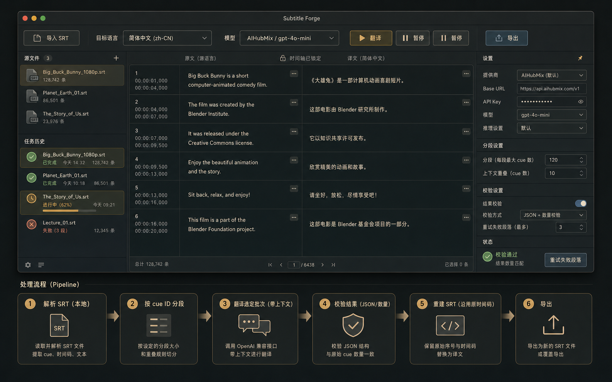
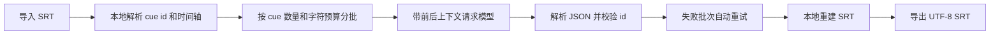

# 字幕锻造

字幕锻造是一个 macOS 字幕翻译工具，默认使用 AIHubMix 的 OpenAI 兼容接口，也可以切换到任意兼容 `/v1/chat/completions` 或 `/v1/responses` 的大模型服务。



## 核心设计

- 本地解析 SRT：序号和时间轴不会交给模型重写。
- 分批翻译：按 cue 数量和字符预算切分，支持上下文重叠，避免超长文件一次性塞进模型。
- JSON 校验：模型必须按 cue id 返回译文，本地检查漏译和多译。
- 本地重建：导出时使用原始序号和时间轴，只替换字幕文本。
- 模型设置 Tab：密钥、接口地址、模型名、聊天补全/Responses、推理深度、输出长度和分段策略都可调整。
- 支持从 Finder 直接拖入一个或多个 `.srt` 文件。
- 后台记忆库 Tab：可保存人名、泰语名、术语等固定译法，每次翻译都会注入提示词。
- 译文查找替换：可搜索译文中的错误并替换一个或全部匹配项。
- 外观模式：默认跟随 macOS 深浅色，也可在工具栏或右侧设置里手动切换浅色/深色。
- 翻译完成后会在原字幕文件夹下自动生成一个新版本，避免覆盖原文件。
- 历史记录支持移到回收箱，15 天后自动清理，也可以手动永久删除。
- 疑似未确认人名会在翻译完成后高亮提醒检查。

## 默认接口

```text
接口名称: AIHubMix
接口地址: https://aihubmix.com/v1
模型: gpt-5.5
接口模式: 聊天补全
```

密钥会写入 macOS Keychain，不会提交到 git。

## 记忆库

右侧设置面板可以维护固定译法，例如：

```text
Ko Song -> Ko Song
เซิร์ฟ -> Surf
จาว่า -> Java
จิมมี่ -> Jimmy
ซี -> Sea
```

这些条目会随模型请求一起发送，用来保护人名和常用名，避免把 `Ko Song` 误译成 `二哥` 这类字面翻译。

## 长字幕处理流程



## 运行

```bash
./script/build_and_run.sh
```

其他模式：

```bash
./script/build_and_run.sh --verify
./script/build_and_run.sh --logs
./script/build_and_run.sh --debug
```

## 测试

```bash
swift test
```

## 版本管理

项目已经初始化为 git 仓库，主分支为 `main`。建议每次完成一个可验证能力后提交，例如：

```bash
git status
git add .
git commit -m "Add subtitle translation mac app scaffold"
```
