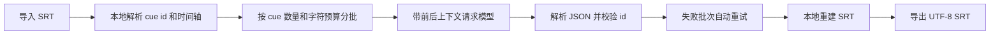

# Subtitle Forge

Subtitle Forge 是一个 macOS 字幕翻译工具，默认使用 AIHubMix 的 OpenAI 兼容接口，也可以切换到任意兼容 `/v1/chat/completions` 或 `/v1/responses` 的大模型服务。


## 核心设计

- 本地解析 SRT：序号和时间轴不会交给模型重写。
- 分批翻译：按 cue 数量和字符预算切分，支持上下文重叠，避免超长文件一次性塞进模型。
- JSON 校验：模型必须按 cue id 返回译文，本地检查漏译和多译。
- 本地重建：导出时使用原始序号和时间轴，只替换字幕文本。
- 可配置接口：密钥、接口地址、模型名、聊天补全/Responses、推理深度、输出长度都可调整。
- 支持从 Finder 直接拖入一个或多个 `.srt` 文件。

## 默认接口

```text
接口名称: AIHubMix
接口地址: https://aihubmix.com/v1
模型: gpt-5.5
接口模式: 聊天补全
```

密钥会写入 macOS Keychain，不会提交到 git。

## 长字幕处理流程



## 运行

```bash
./script/build_and_run.sh
```

其他模式：

```bash
./script/build_and_run.sh --verify
./script/build_and_run.sh --logs
./script/build_and_run.sh --debug
```

## 测试

```bash
swift test
```

## 版本管理

项目已经初始化为 git 仓库，主分支为 `main`。建议每次完成一个可验证能力后提交，例如：

```bash
git status
git add .
git commit -m "Add subtitle translation mac app scaffold"
```
